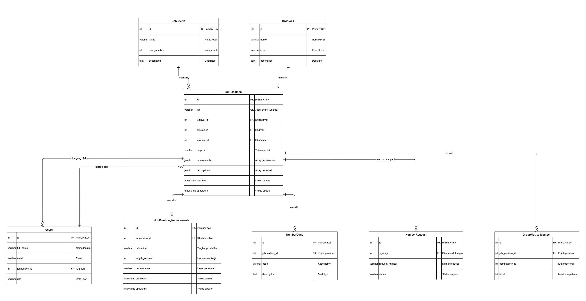

# Dokumentasi Teknikal - IT Developer Intern Test
#### Muhammad Aryaka Zamzami

## Introduction
Aplikasi ini adalah sebuah RESTful API yang dibangun menggunakan Node.js dengan framework Express.js. Modul ini berfungsi sebagai layanan backend untuk mengelola data posisi pekerjaan, struktur organisasi, dan persyaratan kualifikasi (career form) dalam sebuah organisasi.

**Fitur Utama**

* Job Position Management: CRUD lengkap untuk mengelola posisi pekerjaan
* Pengambilan daftar seluruh posisi pekerjaan
* Pengambilan detail posisi pekerjaan berdasarkan ID
* Pengambilan detail posisi pekerjaan berdasarkan JobTitle

**Teknologi yang Digunakan**

* Runtime Environment: Node.js
* Framework: Express.js
* Database: PostgreSQL
* ORM: Sequelize
* Architecture Pattern: MVC (Model-View-Controller) + Repository Pattern
* Data Format: JSON/JSONB untuk data kompleks (requirements, descriptions)

**Use Case**

Aplikasi ini cocok digunakan untuk:

* HR Management System, untuk mengelola posisi jabatan pekerjaan dan struktur organisasi
* Sistem rekrutmen untuk mendefinisikan persyaratan posisi
* Career development tracking dengan career form requirements


## Architecture
**Struktur Folder**
```bash
.
├── controllers
│   └── jobposition.controllers.js     # logika utama (Handler request/response)
├── migrations
│   ├── create-job-position.js         # skema awal tabel JobPositions
│   ├── change-jobposition-array.js    # modifikasi tipe data kolom (Array ke JSONB)
│   └── create-jobposition-requirement.js # skema tabel JobPosition_Requirements
├── models
│   ├── jobposition.js                 # model Sequelize & Relasi untuk JobPosition
│   └── jobpositionrequirement.js      # model Sequelize untuk Requirement
├── repositories
│   └── jobpositionrequirements.repository.js # layer akses database khusus Requirement
└── routes
    └── jobposition.routes.js          # endpoint HTTP
```

**Komponen Utama**
1. Controllers (jobposition.controllers.js)

    Controllers berisi business logic dan handler untuk setiap endpoint. Fungsi utama:
    * create: Membuat job position baru dengan validasi duplikasi title
    * findAll: Mengambil semua job positions dengan relasi lengkap (division, job level, superior, requirements)
    * findByJobId: Mengambil detail job position berdasarkan ID
    * findByJobTitle: Mengambil job position berdasarkan title
    * updateById: Update job position dan career form requirements
    * delete: Soft/hard delete job position

2. Migrations
    * create-job-position.js: membuat tabel JobPositions
    * change-jobposition-array.js: mengubah tipe data dari ARRAY ke JSONB pada fields requirements dan descriptions (Alasan: JSONB lebih fleksibel untuk data kompleks dan mendukung indexing)
    * create-jobposition-requirement.js: membuat tabel JobPosition_Requirements


3. Models

    JobPosition Model (jobposition.js):

    * Mendefinisikan struktur tabel JobPositions
    * Multiple associations (belongsTo dan hasMany)
    * Unique constraint pada field title
    * Fields: title (string), joblevel_id (integer), division_id (integer), superior_id (integer), purpose (string), requirements (JSONB), descriptions (JSONB)

    JobPosition_Requirement Model (jobpositionrequirement.js):

    * Relasi belongsTo ke JobPosition
    * Fields: jobposition_id (integer), education (string), length_service (integer), performance (string)

4. Repositories (jobpositionrequirements.repository.js)

    Repository pattern untuk memisahkan data access logic:

    * findOneByJobPositionId: Mencari requirement berdasarkan job position ID
    * create: Membuat requirement baru dengan transaction support
    * updateByJobPositionId: Update requirement berdasarkan job position ID

    Keuntungan Repository Pattern:

    * Abstraksi query logic dari controller
    * Mudah untuk testing dengan mocking
    * Transaction management yang lebih baik

5. Routes (jobposition.routes.js)

    Mendefinisikan endpoint API dengan Express Router:
    ```bash
    POST   /           // Create job position
    GET    /           // Get all job positions
    GET    /:id        // Get job position by ID
    PUT    /:id        // Update job position
    DELETE /           // Delete job position
    ```
    Note: terdapat duplikasi route `GET /` untuk `findAll` dan `findByJobTitle`. `findByJobTitle` menggunakan endpoint `GET /` untuk `findAll`, namun memproses `req.body`. hal ini berpotensi bug karena menggunakan body pada GET request.

**Flow Program**

_Flow Diagram: Create Job Position_
```bash
1. Client Request
   POST /api/jobposition
   Body: { title, joblevel_id, division_id, superior_id, 
           purpose, requirements[], descriptions[] }
   |
   V
2. Route Handler
   jobposition.routes.js → jobPositionController.create()
   |
   V
3. Controller Logic
   - Validasi: Cek apakah title sudah ada (JobPosition.findOne)
   - Jika exist → return 400 Bad Request
   |
   V
4. Create Record
   - JobPosition.create() dengan semua field
   - Sequelize execute INSERT query
   |
   V
5. Database
   - Insert ke tabel JobPositions
   - Return record dengan id, createdAt, updatedAt
   |
   V
6. Response
   - res.sendDataCreated() dengan status 201
   - Return: id, title, descriptions, timestamps
```

_Flow Diagram: Get All Job Positions_
```bash
1. Client Request
   GET /api/jobposition
   |
   V
2. Route Handler
   jobposition.routes.js → jobPositionController.findAll()
   |
   V
3. Controller Logic
   - JobPosition.findAll() dengan include:
     * Division (id, name)
     * JobLevel (id, name)
     * User as superior (id, full_name)
     * JobPosition_Requirement
   - Order by job_level.id ASC
   |
   V
4. Database Query
   - Execute JOIN query dengan 4 tabel
   - Sequelize ORM handle kompleksitas
   |
   V
5. Data Transformation
   - Map hasil query ke response format
   - Flatten relasi (joblevel_id, joblevel_name, dll)
   |
   V
6. Response
   - res.sendJson() dengan status 200
   - Return array of job positions dengan semua relasi
```

_Flow Diagram: Update with Career Form_
```bash
1. Client Request
   PUT /api/jobposition/:id
   Body: { title, ..., careerForm: {...} }
   |
   V
2. Controller Logic
   - Extract id dari params
   - Extract body data
   |
   V
3. Update Job Position
   - JobPosition.update() dengan kondisi where: { id }
   - Update fields: title, joblevel_id, division_id, dll
   |
   V
4. Handle Career Form
   - Cek apakah sudah ada requirement:
     jobposreq = findOneByJobPositionId(position_id)
   
   A. Jika BELUM ada:
      - Start transaction
      - Create new JobPosition_Requirement
      - Commit transaction
   
   B. Jika SUDAH ada:
      - Update existing requirement
      - updateByJobPositionId()
   |
   V
5. Response
   - res.sendJson() dengan status 200
   - Return update result
```

_Flow Diagram: Error Handling_
```bash
Try-Catch Block di setiap controller method:

try {
  // Business logic
  // Database operations
} catch (error) {
  // Error terjadi
  res.sendServerError(error.message)
  // Status 500 dengan error message
}
```

## API Documentation
**Base URL**`http://localhost:3000/api/jobposition`

**POST / - Create Job Position (Membuat job position baru)**
```bash
    // req body
    {
    "title": "Senior Software Engineer",
    "joblevel_id": 3,
    "division_id": 2,
    "superior_id": 5,
    "purpose": "Lead development team and architect scalable solutions",
    "requirements": [
        "Bachelor degree in Computer Science",
        "5+ years experience in software development",
        "Strong leadership skills"
    ],
    "descriptions": [
        "Design and implement software solutions",
        "Lead and mentor junior developers",
        "Collaborate with product team",
        "Code review and quality assurance"
    ]
    }

    // response success (201 Created):
    {
    "success": true,
    "message": "Success create a new Job Position and its Description",
    "data": {
        "id": 15,
        "title": "Senior Software Engineer",
        "descriptions": [
        "Design and implement software solutions",
        "Lead and mentor junior developers",
        "Collaborate with product team",
        "Code review and quality assurance"
        ],
        "createdAt": "2024-01-16T10:30:00.000Z",
        "updatedAt": "2024-01-16T10:30:00.000Z"
    }
    }

    // response error (400 Bad Request)
    {
    "success": false,
    "message": "Job Title already exists. Consider editing the the job or use another name."
    }
```
**GET / - Get All Job Positions (Mengambil semua job positions dengan relasi lengkap)**
```bash
    // response success (200 OK)
    {
    "statusCode": 200,
    "success": true,
    "message": "success find all data",
    "data": [
        {
        "id": 1,
        "title": "Senior Software Engineer",
        "joblevel_id": 3,
        "joblevel_name": "Senior Level",
        "division_id": 2,
        "division_name": "Engineering",
        "superior_id": 5,
        "superior_name": "John Doe",
        "purpose": "Lead development team and architect scalable solutions",
        "requirements": [
            "Bachelor degree in Computer Science",
            "5+ years experience in software development",
            "Strong leadership skills"
        ],
        "descriptions": [
            "Design and implement software solutions",
            "Lead and mentor junior developers",
            "Collaborate with product team",
            "Code review and quality assurance"
        ],
        "careerForm": [
            {
            "id": 1,
            "jobposition_id": 1,
            "education": "Bachelor Degree",
            "length_service": 5,
            "performance": "Exceeds Expectations",
            "createdAt": "2024-01-16T10:30:00.000Z",
            "updatedAt": "2024-01-16T10:30:00.000Z"
            }
        ],
        "createdAt": "2024-01-15T08:00:00.000Z",
        "updatedAt": "2024-01-16T10:30:00.000Z"
        }
    ]
    }
```
**GET /:id - Get Job Position by ID (Mengambil detail job position berdasarkan ID)**
```bash
id (integer): ID job position

> contoh request GET /api/jobposition/15

// response success (200 OK):
{
  "statusCode": 200,
  "success": true,
  "message": "success find data",
  "data": {
    "id": 15,
    "title": "Senior Software Engineer",
    "joblevel_id": 3,
    "joblevel_name": "Senior Level",
    "division_id": 2,
    "division_name": "Engineering",
    "superior_id": 5,
    "superior_name": "John Doe",
    "purpose": "Lead development team and architect scalable solutions",
    "requirements": [
      "Bachelor degree in Computer Science",
      "5+ years experience in software development",
      "Strong leadership skills"
    ],
    "descriptions": [
      "Design and implement software solutions",
      "Lead and mentor junior developers",
      "Collaborate with product team",
      "Code review and quality assurance"
    ],
    "careerForm": [
      {
        "id": 1,
        "jobposition_id": 15,
        "education": "Bachelor Degree",
        "length_service": 5,
        "performance": "Exceeds Expectations",
        "createdAt": "2024-01-16T10:30:00.000Z",
        "updatedAt": "2024-01-16T10:30:00.000Z"
      }
    ]
  }
}

// response error (500): 
{
  "statusCode": 500,
  "success": false,
  "message": "Error message detail"
}
```

**PUT /:id - Update Job Position (Update job position dan career form requirements)**
```bash
id (integer): ID job position yang akan diupdate

// req body
{
  "title": "Senior Software Engineer - Updated",
  "joblevel_id": 3,
  "division_id": 2,
  "superior_id": 5,
  "purpose": "Updated purpose",
  "requirements": [
    "Updated requirement 1",
    "Updated requirement 2"
  ],
  "descriptions": [
    "Updated description 1",
    "Updated description 2"
  ],
  "careerForm": {
    "education": "Master Degree",
    "length_service": 7,
    "performance": "Outstanding"
  }
}

// response success (200 OK):
{
  "statusCode": 200,
  "success": true,
  "message": "Success update Jobdesc",
  "data": [1]
}
Note: [1] menunjukkan jumlah row yang terupdate

// response error (204 No Content):
{
  "statusCode": 204,
  "success": false,
  "message": "Error update Jobdesc"
}
```
**DELETE / - Delete Job Position (Menghapus job position berdasarkan ID)**
```bash
// request body
{
  "id": 15
}

// response success (200 OK):
{
  "statusCode": 200,
  "success": true,
  "message": "success delete job position",
  "data": 1
}
Note: 1 menunjukkan jumlah row yang terhapus

// Response Error (204 No Content):
{
  "statusCode": 204,
  "success": false,
  "message": "id job position not found"
}
```

## API Response
Menggunakan custom response helpers dengan format konsisten:

**Success response**
```bash
{
  statusCode: number,
  success: true,
  message: string,
  data: object | array
}
```
**Error response**
```bash
{
  statusCode: number,
  success: false,
  message: string
}
```
**Custom Response Methods:**
* res.sendDataCreated() - 201 Created
* res.sendJson() - 200 OK dengan custom message
* res.sendBadRequest() - 400 Bad Request
* res.sendNoContent() - 204 No Content
* res.sendServerError() - 500 Internal Server Error

## Database Schema
Database menggunakan PostgreSQL dengan ORM Sequelize.

**Tabel JobPositions**

Tabel utama untuk menyimpan data posisi pekerjaan.
| Field  | Type | Constraints  | Description |
| ------------- |:-------------:|:------------: |:-------------:|
|id|INTEGER|PRIMARY KEY, AUTO_INCREMENT|unique ID job position|
|title|VARCHAR|NOT NULL, UNIQUE|Nama/judul posisi|
|joblevel_id|INTEGER|FOREIGN KEY|ID job level|
|division_id|INTEGER|FOREIGN KEY|ID division/departemen|
|superior_id|INTEGER|FOREIGN KEY, NULLABLE|ID user sebagai atasan|
|purpose|VARCHAR|NULL|Tujuan/purpose posisi|
|requirements|JSONB|DEFAULT []|Array persyaratan umum|
|descriptions|JSONB|DEFAULT []|Array deskripsi pekerjaan|
|createdAt|TIMESTAMP|NOT NULL, DEFAULT NOW()|Waktu pembuatan|
|updatedAt|TIMESTAMP|NOT NULL, DEFAULT NOW()|Waktu update terakhir|

Indexes:
* PRIMARY KEY pada `id`
* UNIQUE INDEX pada `title`
* INDEX pada `joblevel_id`, `division_id`, `superior_id` (untuk JOIN performance)

**Tabel JobPosition_Requirements**

Tabel untuk menyimpan career form requirements (persyaratan karir).
| Field  | Type | Constraints  | Description |
| ------------- |:-------------:|:------------: |:-------------:|
|id|INTEGER|PRIMARY KEY, AUTO_INCREMENT|ID unik requirement|
|jobposition_id|INTEGER|NOT NULL, FOREIGN KEY|ID job position|
|education|VARCHAR|NULL|Tingkat pendidikan diperlukan|
|length_service|INTEGER|NULL|Lama masa kerja minimal (tahun)|
|performance|VARCHAR|NULL|Level performa yang diharapkan|
|createdAt|TIMESTAMP|NOT NULL, DEFAULT NOW()|Waktu pembuatan|
|updatedAt|TIMESTAMP|NOT NULL, DEFAULT NOW()|Waktu update terakhir|

Indexes:
* PRIMARY KEY pada id
* FOREIGN KEY jobposition_id REFERENCES JobPositions(id)
* INDEX pada jobposition_id untuk query performance

**Relasi Database**

* JobPositions -> JobLevels (Many-to-One)
* JobPositions -> Divisions (Many-to-One)
* JobPositions -> Users (as superior) (Many-to-One)
* JobPositions -> JobPosition_Requirements (One-to-Many)
* JobPositions -> Users (as jobposition) (One-to-Many)
* JobPositions -> NumberCode (One-to-Many)
* JobPositions -> NumberRequest (as signer) (One-to-Many)
* JobPositions -> GroupMatrix_Member (One-to-Many)

## ERD


## Thank You